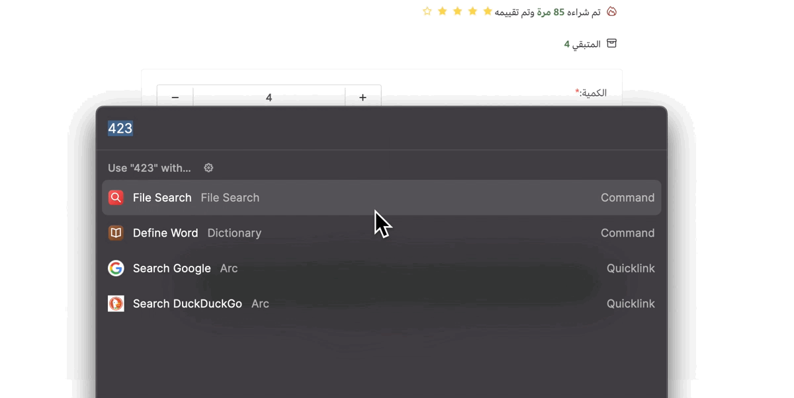

# Arabic to English text input 🌀

This project aims to demonstrate a simple solution for users trying to write arabic numbers inside an input with type number

**Please visit the [docs](https://arabic-to-english-input.vercel.app/) for more info.**
 

## Motivation
After encountering this issue  in many sites, I decided to make a simple solution for it that works with almost all front end frameworks and libraries.

Thanks for [Drahim](https://drah.im/login) for the idea.
