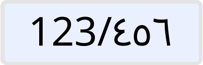

# Arabic to English text input 🌀

 
This is a small attempt to enhance the ux for Arabic users on the web/mobile.

In this project I provide a text input in various frameworks that allows the user to type Arabic digits and get the English equivalent.

## How did I do it?
I used [Mitosis](https://github.com/BuilderIO/mitosis/tree/main) to generate the text input for many famous frameworks e.g (React,Solid,Vue,Angular,etc). 

## contribution
If you found an issue/enhancement with your framework code, do not hesitate to open a pr 👋.

### references
conversion function is taken from [here](https://stackoverflow.com/questions/31439604/how-to-convert-persian-and-arabic-digits-of-a-string-to-english-using-javascript).